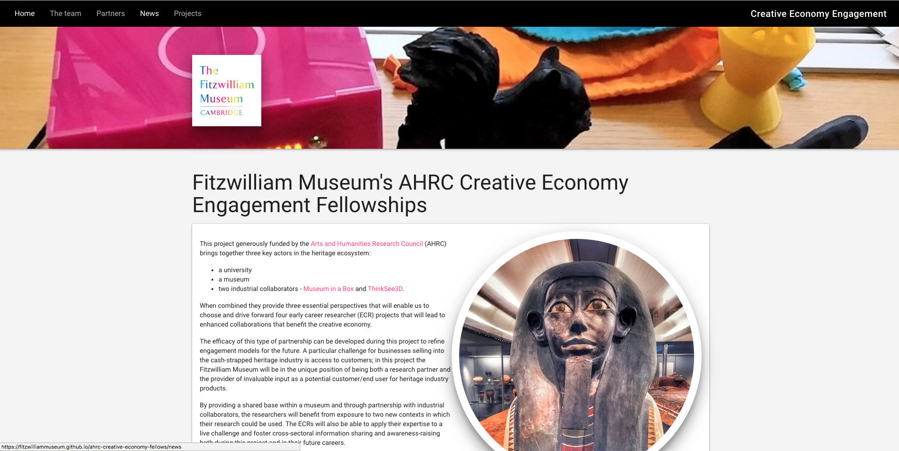

# The Creative Economy Engagement  - Fitzwilliam Museum
 

This repository will hold code for the CEEF programme, documenting the work of a multidisciplinary
team at the Fitzwilliam Museum, Cambridge University.

## To run locally

* Install Jekyll on your machine following these [instructions](https://jekyllrb.com/docs/installation/)
* Install Git on your machine following these [instructions](https://git-scm.com/book/en/v2/Getting-Started-Installing-Git)
* Clone the code for this repository:
   `git clone https://github.com/FitzwilliamMuseum/ahrc-creative-economy-fellows.git`
* Change to the directory and then run this command in terminal `jekyll serve`

## Credits

Content by Abi L Glen, Joanne Vine, Melanie Pitkin, Daniel Pett, Catriona Cooper,
Jennifer Wexler. Copyright the University of Cambridge unless noted otherwise.

Website by [@portableant](https://github.com/portableant)

CSS framework: http://daemonite.github.io/material/

## License

CC-BY for code, CC-BY-NC-SA-ND for content (text and images) unless stated
otherwise.

## Contributing guidelines

If you want to contribute fixes to this site, you are very welcome to do so. To
do this, either add a [bug report under issues](https://github.com/FitzwilliamMuseum/ahrc-creative-economy-fellows/issues)
or fork the repository and create a new branch for proposed fixes and then submit
a pull request.
